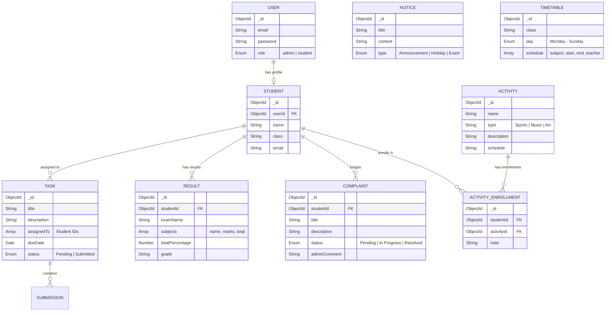

<p align="center">
  <h1 align="center">🏫 School.MS — Precision School Management System</h1>
  <p align="center">
    A full-stack web application for streamlined academic & administrative management.
    <br />
    <strong>React.js · Node.js · Express · MongoDB</strong>
  </p>
</p>

<p align="center">
  
  
  
  
  
</p>

---

## 📋 Table of Contents

- [About the Project](#-about-the-project)
- [Key Features](#-key-features)
- [Tech Stack](#-tech-stack)
- [Architecture](#-architecture)
- [Project Structure](#-project-structure)
- [Getting Started](#-getting-started)
  - [Prerequisites](#prerequisites)
  - [Installation](#installation)
  - [Environment Variables](#environment-variables)
  - [Running the Application](#running-the-application)
  - [Seeding the Database](#seeding-the-database)
- [Default Credentials](#-default-credentials)
- [API Reference](#-api-reference)
- [Database Schema](#-database-schema)
- [Role-Based Access](#-role-based-access)
- [Screenshots](#-screenshots)
- [Contributing](#-contributing)
- [License](#-license)

---

## 📖 About the Project

**School.MS** is a production-grade, full-stack School Management System designed to bridge the communication gap between **students** and **administrators**. It serves as a centralized platform that provides role-based dashboards, enabling efficient management of academics, assignments, results, complaints, extracurricular activities, and official school announcements.

The system features a **3-phase database connection strategy** that supports MongoDB Atlas (cloud), local MongoDB instances, and an automatic in-memory fallback — making it runnable on any machine without requiring a pre-installed database.

---

## ✨ Key Features

### 👨‍💼 Admin Dashboard
| Feature | Description |
|---|---|
| **Student Management** | Full CRUD — add, edit, delete student profiles with linked user accounts |
| **Assignment Management** | Create & assign tasks to students, track submission status |
| **Notice Board** | Publish categorized announcements (Exam, Holiday, Announcement) |
| **Result Management** | Record exam results per student with subject-wise marks, auto-grade, and percentage |
| **Progress Reports** | View detailed per-student academic progress with historical data |
| **Timetable Management** | Create and manage class-wise, day-wise schedules with teacher assignments |
| **Complaint Resolution** | Review and resolve student complaints with admin comments |
| **Activity Management** | Create extracurricular activities and view enrollment data |

### 🎓 Student Dashboard
| Feature | Description |
|---|---|
| **Dashboard Overview** | Real-time academic statistics and key metrics at a glance |
| **Assignments** | View assigned tasks, submit work, and track due dates |
| **Notice Board** | Stay updated with school-wide announcements |
| **Study Resources** | Access centralized study materials and learning resources |
| **Timetable** | View class schedule organized by day |
| **Results** | Check exam results with subject-wise breakdown |
| **Complaints** | Lodge complaints and track resolution status |
| **Extracurricular** | Browse activities and submit enrollment interest |

### 🔐 Security & Auth
- JWT-based authentication with HTTP-only cookie storage
- Password hashing with **bcryptjs**
- Role-based middleware (`admin` / `student`) for route protection
- Automatic session validation via `/auth/me` endpoint
- Global 401 interceptor for seamless session expiry handling

---

## 🛠 Tech Stack

### Frontend
| Technology | Purpose |
|---|---|
| **React 19** | UI component library |
| **Vite 8** | Lightning-fast build tool & dev server |
| **React Router DOM 7** | Client-side routing with nested layouts |
| **Axios** | HTTP client with interceptors |
| **Recharts** | Data visualization & charts on dashboards |
| **Lucide React** | Modern icon library |
| **ESLint** | Code quality & linting |

### Backend
| Technology | Purpose |
|---|---|
| **Node.js** | Runtime environment |
| **Express 5** | Web framework (Modular MVC architecture) |
| **Mongoose 9** | MongoDB ODM for schema modeling |
| **MongoDB Memory Server** | In-memory database fallback (zero-config) |
| **JWT (jsonwebtoken)** | Stateless authentication tokens |
| **bcryptjs** | Secure password hashing |
| **cookie-parser** | HTTP-only cookie handling |
| **cors** | Cross-origin resource sharing |
| **dotenv** | Environment variable management |

---

## 🏗 Architecture

```
┌─────────────────────────────────────────────────────────┐
│                      CLIENT (React)                     │
│  ┌─────────┐  ┌──────────┐  ┌────────┐  ┌───────────┐  │
│  │  Pages  │  │Components│  │Context │  │ Services  │  │
│  └────┬────┘  └─────┬────┘  └───┬────┘  └─────┬─────┘  │
│       └─────────────┴──────────┴────────────────┘       │
│                         │ Axios (HTTP)                   │
└─────────────────────────┼───────────────────────────────┘
                          │
                    ┌─────▼─────┐
                    │   CORS    │
                    └─────┬─────┘
                          │
┌─────────────────────────┼───────────────────────────────┐
│                   SERVER (Express)                       │
│  ┌──────────┐  ┌────────▼───────┐  ┌─────────────────┐  │
│  │Middleware│──│    Routes      │──│  Controllers    │  │
│  │(JWT,RBAC)│  │  /api/v1/*     │  │  (Business)     │  │
│  └──────────┘  └────────────────┘  └───────┬─────────┘  │
│                                            │             │
│                                   ┌────────▼──────────┐  │
│                                   │    Services       │  │
│                                   │  (Data Access)    │  │
│                                   └────────┬──────────┘  │
│                                            │             │
│                                   ┌────────▼──────────┐  │
│                                   │  Mongoose Models  │  │
│                                   └────────┬──────────┘  │
└────────────────────────────────────────────┼─────────────┘
                                             │
                          ┌──────────────────▼──────────────────┐
                          │          MongoDB Database           │
                          │  Cloud Atlas │ Local │ In-Memory    │
                          └────────────────────────────────────┘
```

**Backend follows the MVC + Service Layer pattern:**
- **Routes** → Define API endpoints & attach middleware
- **Controllers** → Handle request/response logic
- **Services** → Encapsulate business logic & database operations
- **Models** → Define MongoDB schemas via Mongoose
- **Middlewares** → JWT auth, role-based access control, error handling
- **Utils** → Async wrappers, response helpers

---

## 📁 Project Structure

```
SchoolManagementSystem/
├── DivyaProject/
│   ├── backend/
│   │   ├── config/
│   │   │   └── db.js                  # 3-phase DB connection (Atlas → Local → Memory)
│   │   ├── controllers/
│   │   │   ├── authController.js      # Login, logout, session check
│   │   │   ├── studentController.js   # Student CRUD operations
│   │   │   ├── taskController.js      # Assignment management
│   │   │   ├── noticeController.js    # Notice board operations
│   │   │   ├── resultController.js    # Results & progress reports
│   │   │   ├── timetableController.js # Timetable management
│   │   │   ├── complaintController.js # Complaint handling
│   │   │   ├── activityController.js  # Extracurricular management
│   │   │   └── userController.js      # User account operations
│   │   ├── middlewares/
│   │   │   ├── auth.middleware.js      # JWT token verification
│   │   │   ├── authMiddleware.js       # Bearer token + admin guard
│   │   │   ├── role.middleware.js      # Admin-only access control
│   │   │   ├── error.middleware.js     # Global error handler
│   │   │   └── errorHandler.js        # Error response utility
│   │   ├── models/
│   │   │   ├── User.js                # Auth user (email, password, role)
│   │   │   ├── Student.js             # Student profile (linked to User)
│   │   │   ├── Task.js                # Assignment with submissions
│   │   │   ├── Notice.js              # Announcements (typed)
│   │   │   ├── Result.js              # Exam results with subjects
│   │   │   ├── Complaint.js           # Student complaints
│   │   │   ├── TimeTable.js           # Class-wise day schedules
│   │   │   ├── Activity.js            # Extracurricular activities
│   │   │   └── ActivityEnrollment.js  # Student ↔ Activity junction
│   │   ├── routes/
│   │   │   ├── auth.routes.js         # POST /login, /logout, GET /me
│   │   │   ├── student.routes.js      # CRUD /students (admin-only)
│   │   │   ├── task.routes.js         # CRUD /tasks
│   │   │   ├── notice.routes.js       # CRUD /notices
│   │   │   ├── result.routes.js       # CRUD /results + /progress
│   │   │   ├── timetable.routes.js    # CRUD /timetable
│   │   │   ├── complaint.routes.js    # CRUD /complaints
│   │   │   └── activity.routes.js     # CRUD /activities + /enroll
│   │   ├── services/
│   │   │   ├── studentService.js      # Student data access layer
│   │   │   ├── taskService.js         # Task data access layer
│   │   │   ├── noticeService.js       # Notice data access layer
│   │   │   ├── resultService.js       # Result data access layer
│   │   │   ├── timetableService.js    # Timetable data access layer
│   │   │   ├── complaintService.js    # Complaint data access layer
│   │   │   └── activityService.js     # Activity data access layer
│   │   ├── utils/
│   │   │   ├── asyncWrapper.js        # Async error catcher for routes
│   │   │   └── responseHelper.js      # Standardized API response format
│   │   ├── .env.example               # Environment template
│   │   ├── app.js                     # Express app configuration
│   │   ├── server.js                  # Server bootstrap & DB connect
│   │   ├── seed.js                    # Sample data seeder
│   │   └── package.json
│   │
│   ├── frontend/
│   │   ├── public/                    # Static assets
│   │   ├── src/
│   │   │   ├── components/
│   │   │   │   ├── Layout/
│   │   │   │   │   ├── Layout.jsx     # Main app shell with sidebar
│   │   │   │   │   ├── Navbar.jsx     # Top navigation bar
│   │   │   │   │   └── Sidebar.jsx    # Side navigation menu
│   │   │   │   └── ProtectedRoute.jsx # Auth & role-based route guard
│   │   │   ├── context/
│   │   │   │   └── AuthContext.jsx    # Global auth state (React Context)
│   │   │   ├── pages/
│   │   │   │   ├── Login.jsx          # Authentication page
│   │   │   │   ├── Dashboard.jsx      # Overview with stats & charts
│   │   │   │   ├── Students.jsx       # Student management (admin)
│   │   │   │   ├── StudentList.jsx    # Student listing component
│   │   │   │   ├── Assignments.jsx    # Assignment tracking
│   │   │   │   ├── Tasks.jsx          # Task view for students
│   │   │   │   ├── Notices.jsx        # Notice board display
│   │   │   │   ├── StudyResources.jsx # Study materials hub
│   │   │   │   ├── Timetable.jsx      # Schedule grid view
│   │   │   │   ├── Results.jsx        # Exam results display
│   │   │   │   ├── ProgressReport.jsx # Per-student progress (admin)
│   │   │   │   ├── Complaints.jsx     # Complaint system
│   │   │   │   └── Extracurricular.jsx# Activity enrollment
│   │   │   ├── services/
│   │   │   │   └── api.js             # Axios instance with interceptors
│   │   │   ├── hooks/                 # Custom React hooks
│   │   │   ├── utils/                 # Frontend utilities
│   │   │   ├── assets/                # Images & static resources
│   │   │   ├── App.jsx                # Root component with routing
│   │   │   ├── main.jsx               # React DOM entry point
│   │   │   └── index.css              # Global styles
│   │   ├── .env.example               # Frontend env template
│   │   ├── index.html                 # HTML entry point
│   │   ├── vite.config.js             # Vite configuration
│   │   └── package.json
│   │
│   ├── .gitignore
│   └── push_to_github.bat
│
└── README.md                          # ← You are here
```

---

## 🚀 Getting Started

### Prerequisites

| Requirement | Version |
|---|---|
| **Node.js** | v18+ recommended |
| **npm** | v9+ |
| **MongoDB** | Optional — in-memory fallback is available |

> **💡 No MongoDB? No problem!** Set `USE_MEMORY_DB=true` in the backend `.env` file and the app will use an in-memory MongoDB instance automatically. Perfect for development and demos.

### Installation

```bash
# 1. Clone the repository
git clone https://github.com/<your-username>/SchoolManagementSystem.git
cd SchoolManagementSystem/DivyaProject

# 2. Install backend dependencies
cd backend
npm install

# 3. Install frontend dependencies
cd ../frontend
npm install
```

### Environment Variables

#### Backend (`backend/.env`)

Create from template:
```bash
cp .env.example .env
```

| Variable | Default | Description |
|---|---|---|
| `PORT` | `8000` | Server port |
| `MONGODB_URI` | `your_mongodb_connection_string` | MongoDB Atlas or local URI |
| `JWT_SECRET` | `your_jwt_secret` | Secret key for JWT signing |
| `NODE_ENV` | `development` | Environment mode |
| `USE_MEMORY_DB` | `true` | Force in-memory MongoDB (no install needed) |

#### Frontend (`frontend/.env`)

Create from template:
```bash
cp .env.example .env
```

| Variable | Default | Description |
|---|---|---|
| `VITE_API_URL` | `http://localhost:8000/api/v1` | Backend API base URL |

### Running the Application

Open **two terminal windows**:

**Terminal 1 — Backend:**
```bash
cd DivyaProject/backend
npm start
# → Server running on port 8000
# → MongoDB Connected: In-Memory Mode
```

**Terminal 2 — Frontend:**
```bash
cd DivyaProject/frontend
npm run dev
# → Local: http://localhost:5173
```

Open your browser and navigate to **`http://localhost:5173`**.

### Seeding the Database

When using **in-memory mode** (`USE_MEMORY_DB=true`), the database is automatically seeded on startup with sample data including:

- 1 Admin user
- 3 Student users with profiles
- 2 Sample assignments
- 3 Sample notices (Announcement, Holiday, Exam)

For manual seeding (non-memory mode):
```bash
cd DivyaProject/backend
npm run seed
```

---

## 🔑 Default Credentials

After seeding, use these accounts to log in:

| Role | Email | Password |
|---|---|---|
| 🔴 **Admin** | `admin@school.com` | `password123` |
| 🟢 **Student 1** | `s1@school.com` | `password123` |
| 🟢 **Student 2** | `s2@school.com` | `password123` |
| 🟢 **Student 3** | `s3@school.com` | `password123` |

**Seeded Students:**
| Name | Class | Email |
|---|---|---|
| Aarav Sharma | 10A | s1@school.com |
| Isha Gupta | 10B | s2@school.com |
| Rohan Das | 9A | s3@school.com |

---

## 📡 API Reference

All endpoints are prefixed with `/api/v1`. Authentication is required unless noted.

### 🔐 Authentication

| Method | Endpoint | Access | Description |
|---|---|---|---|
| `POST` | `/auth/login` | Public | Login with email & password |
| `POST` | `/auth/logout` | Authenticated | Logout & clear session |
| `GET` | `/auth/me` | Authenticated | Get current user profile |

### 👨‍🎓 Students (Admin Only)

| Method | Endpoint | Description |
|---|---|---|
| `GET` | `/students` | List all students |
| `POST` | `/students` | Create student with linked user account |
| `PUT` | `/students/:id` | Update student details |
| `DELETE` | `/students/:id` | Delete student & linked account |

### 📝 Tasks / Assignments

| Method | Endpoint | Access | Description |
|---|---|---|---|
| `GET` | `/tasks` | All Users | Get all tasks |
| `POST` | `/tasks` | Admin Only | Create a new task/assignment |
| `PUT` | `/tasks/:id` | All Users | Update task (or submit work) |
| `DELETE` | `/tasks/:id` | Admin Only | Delete a task |

### 📢 Notices

| Method | Endpoint | Access | Description |
|---|---|---|---|
| `GET` | `/notices` | All Users | Get all notices |
| `POST` | `/notices` | Admin Only | Create a new notice |
| `DELETE` | `/notices/:id` | Admin Only | Delete a notice |

### 📊 Results

| Method | Endpoint | Access | Description |
|---|---|---|---|
| `GET` | `/results` | All Users | Get all exam results |
| `POST` | `/results` | Admin Only | Create result entry |
| `GET` | `/results/progress/:studentId` | Admin Only | Get student's progress report |

### 🗓 Timetable

| Method | Endpoint | Access | Description |
|---|---|---|---|
| `GET` | `/timetable` | All Users | Get timetables |
| `POST` | `/timetable` | Admin Only | Create/update timetable entry |
| `DELETE` | `/timetable/:id` | Admin Only | Delete a timetable entry |

### 💬 Complaints

| Method | Endpoint | Access | Description |
|---|---|---|---|
| `GET` | `/complaints` | All Users | List all complaints |
| `POST` | `/complaints` | All Users | Lodge a new complaint |
| `PATCH` | `/complaints/:id/status` | Admin Only | Update complaint status |

### 🎭 Activities & Enrollment

| Method | Endpoint | Access | Description |
|---|---|---|---|
| `GET` | `/activities` | All Users | List all activities |
| `POST` | `/activities` | Admin Only | Create a new activity |
| `POST` | `/activities/enroll` | All Users | Enroll in an activity |
| `GET` | `/activities/enroll` | All Users | Get enrollment records |

---

## 🗄 Database Schema

### Entity Relationship Overview



---

## 🛡 Role-Based Access

The application enforces strict role-based access control across both frontend and backend:

```
┌──────────────────────────────────────────────────────────┐
│                     ADMIN                                │
│  ✅ Dashboard      ✅ Student Management                 │
│  ✅ Create Tasks   ✅ Create Notices                     │
│  ✅ Manage Results ✅ Manage Timetable                   │
│  ✅ Resolve Complaints  ✅ Create Activities              │
│  ✅ View Progress Reports                                │
├──────────────────────────────────────────────────────────┤
│                    STUDENT                               │
│  ✅ Dashboard       ✅ View Assignments                  │
│  ✅ Submit Work     ✅ View Notices                      │
│  ✅ View Timetable  ✅ View Results                      │
│  ✅ Lodge Complaints ✅ Enroll in Activities              │
│  ✅ Study Resources                                      │
│  ❌ Student Management  ❌ Create/Delete Notices          │
│  ❌ Create Tasks        ❌ Manage Results                 │
└──────────────────────────────────────────────────────────┘
```

**Backend enforcement:**
- `auth.middleware.js` — Verifies JWT from HTTP-only cookies
- `role.middleware.js` — `adminOnly` guard blocks non-admin users (HTTP 403)
- `ProtectedRoute.jsx` — Frontend route guard with `adminOnly` prop

---

## 🖼 Screenshots

> _Screenshots can be added here after running the application._
>
> Suggested captures:
> - Login Page
> - Admin Dashboard with charts
> - Student Management (CRUD table)
> - Notice Board
> - Timetable Grid View
> - Results / Progress Report
> - Complaint Resolution Panel
> - Extracurricular Activities

---

## 🤝 Contributing

Contributions are welcome! Here's how:

1. **Fork** the repository
2. **Create** a feature branch (`git checkout -b feature/amazing-feature`)
3. **Commit** your changes (`git commit -m 'Add amazing feature'`)
4. **Push** to the branch (`git push origin feature/amazing-feature`)
5. **Open** a Pull Request

### Development Guidelines

- Follow the existing **MVC + Service Layer** pattern for backend code
- Place new API routes in `routes/`, controllers in `controllers/`, and data logic in `services/`
- Use the `asyncWrapper` utility for all async route handlers
- Use the `responseHelper` for consistent API response formatting
- Frontend components should use the `AuthContext` for auth state
- All API calls should go through the centralized `services/api.js` Axios instance

---

## 📄 License

This project was developed as part of academic research. All rights reserved.

---

<p align="center">
  Made with ❤️ for better school management
</p>
